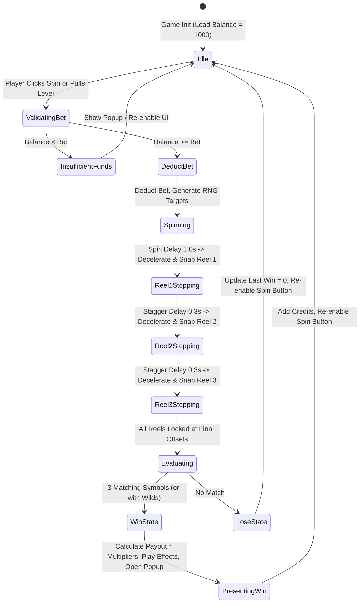

# SpinRush Unity Slot Game Plan

## 1. Objective

Build a fully playable, production-ready 3-reel Unity slot machine game based on the provided design assets and assignment criteria. The project demonstrates clean object-oriented architecture, mathematically sound RNG outcome generation, smooth reel animations with realistic deceleration, rich UI feedback with interactive controls, bonus mechanics, and a verified WebGL build ready for evaluation.

---

## 2. Asset Catalog & Visual Layering Architecture

The project utilizes the custom artwork provided in `Assets/`. Analysis of the source images has established the exact visual layering and geometry:

```text
┌───────────────────────────────────────────────────────────────┐
│ Canvas (1920x1080, Scale with Screen Size)                    │
│ ├── Background Layer (bg_gradient.png)                        │
│ ├── Slot Machine Base (slot-machine4.png - transparent cutouts)│
│ │   └── Reels Container (Clipped Window: x:232..593, y:250..451)│
│ │       ├── Reel 1 (Center X = 283)                           │
│ │       ├── Reel 2 (Center X = 412)                           │
│ │       └── Reel 3 (Center X = 541)                           │
│ ├── Glass Frame Overlay (slot-machine5.png - dividers & gloss)│
│ ├── Interactive Lever (slot-machine2.png / slot-machine3.png) │
│ ├── HUD Panel (slot_machine_Middle_box.png)                   │
│ │   ├── Balance Display (Text / Numeric HUD)                 │
│ │   ├── Current Bet Display                                  │
│ │   └── Last Win Display                                     │
│ ├── Controls Bar                                              │
│ │   ├── Bet Decrease Button (slot_machine_buttons-03.png)     │
│ │   ├── Bet Increase Button (slot_machine_buttons-04.png)     │
│ │   └── Spin Button (slot_machine_buttons-02.png)             │
│ └── Modal Dialog / Win Popup (popup.png + Yes_No_Btn.png)     │
└───────────────────────────────────────────────────────────────┘
```

### Artwork Specifications

| Asset File | Resolution / Layout | Role in Game |
|---|---|---|
| `bg_gradient.png` | 1920×1080 | Full-screen vibrant backdrop gradient |
| `slot-machine4.png` | 816×624 (Transparent window cutout) | Main cabinet body rendered in front of reels |
| `slot-machine1.png` | 816×624 (Opaque reference) | Reference layout for alignment and bevel profiles |
| `slot-machine5.png` | 816×624 (Dividers & gloss overlay) | Glass reflection and vertical column dividers (x=347, 477) |
| `slot-machine2.png` | Lever in upright / idle position | Lever handle default visual state |
| `slot-machine3.png` | Lever in pulled / down position | Lever handle engaged visual state |
| `slot-symbol1.png` | 96×96 (Red Seven / Top Tier) | High-tier symbol (Jackpot / 50x) |
| `slot-symbol2.png` | 96×96 (Orange Bell / Mid-High Tier) | Mid-high symbol (25x) |
| `slot-symbol3.png` | 96×96 (Gold Star / Wild Bonus) | Bonus / Wild symbol (Substitutes + Multiplier) |
| `slot-symbol4.png` | 96×96 (Blue Bar / Base Tier) | Base-tier symbol (10x) |
| `slot_machine_Middle_box.png`| 658×278 panel | Dashboard HUD for Credits, Bet, and Win amounts |
| `slot_machine_buttons-02.png`| 256×1024 (4 vertical cells: 256×256) | Spin / Play button (Normal, Highlight, Pressed, Disabled) |
| `slot_machine_buttons-03.png`| 256×1024 (4 vertical cells: 256×256) | Bet Minus (-) button (4 states) |
| `slot_machine_buttons-04.png`| 256×1024 (4 vertical cells: 256×256) | Bet Plus (+) button (4 states) |
| `Yes_No_Btn.png` | 988×689 (2 cols × 3 rows) | Confirmation & popup buttons (Yes/No with hover/pressed states) |
| `popup.png` | 1740×880 modal frame | Win celebrations, insufficient balance, and game reset modal |
| `4tXlXs.gif` | 85-frame animated sequence | Celebration & jackpot animation reference |

---

## 3. Symbol Definitions & Payout Economy

The slot machine features 4 distinct symbols with a balanced paytable. A win occurs when all 3 reels stop on matching symbols (or matching symbols combined with Wilds).

### Payout Table

| Symbol ID | Name | Sprite Asset | 3-of-a-Kind Payout | Special Rules |
|---|---|---|---:|---|
| `SYM_01` | Lucky Seven (Red) | `slot-symbol1.png` | **50× Bet** | Jackpot symbol |
| `SYM_02` | Golden Bell | `slot-symbol2.png` | **25× Bet** | High tier |
| `SYM_04` | Triple Bar (Blue) | `slot-symbol4.png` | **10× Bet** | Base tier |
| `SYM_03` | Star / Wild (Gold) | `slot-symbol3.png` | **100× Bet** (3 Wilds) | **WILD**: Substitutes for any symbol + 2× Win Multiplier |

### Betting Parameters
- **Starting Balance:** 1,000 Credits
- **Default Bet:** 10 Credits
- **Minimum Bet:** 5 Credits
- **Maximum Bet:** 100 Credits
- **Bet Step:** 5 Credits

---

## 4. Software Architecture & Class Design

The codebase follows SOLID and Object-Oriented principles, strictly decoupling game logic, RNG outcome determination, visual animations, and UI presentation.

```text
Assets/Scripts/
├── Core/
│   ├── GameConstants.cs           // Enums, constants, game config keys
│   ├── GameManager.cs             // High-level game lifecycle and initialization
│   └── RandomNumberGenerator.cs   // Cryptographically fair / seeded RNG service
├── Gameplay/
│   ├── SymbolData.cs              // ScriptableObject for symbol ID, sprite, payout
│   ├── SymbolDatabase.cs          // ScriptableObject database holding all active symbols
│   ├── SlotReel.cs                // Individual reel controller: pooling, scrolling, snapping
│   ├── SlotMachineController.cs   // Central spin coordinator, win evaluation, reel sync
│   ├── WalletManager.cs           // Credit balance, bet validation, payout arithmetic
│   └── LeverController.cs         // Lever drag/click interaction and animation trigger
├── UI/
│   ├── SlotUIManager.cs           // Central UI controller updating HUD, bet controls, spin state
│   ├── MiddleBoxHUD.cs            // Formats and animates Balance, Bet, and Win numeric counters
│   ├── ButtonSpriteStateHelper.cs // Applies 4-state sprite swap to uGUI Buttons
│   ├── WinPopupController.cs      // Modal dialog management (popup.png, Yes/No actions)
│   └── WinEffectsPresenter.cs     // Particle effects, symbol pulsing, celebration banner
└── Utilities/
    ├── AudioController.cs         // Synthesized / imported audio triggers for spins, stops, wins
    └── AutoSpriteSlicer.cs        // Editor utility to automatically slice button and sprite sheets
```

---

## 5. Spin Lifecycle State Machine

The game executes through a deterministic state machine to ensure fair outcomes, prevent race conditions, and deliver high game feel:



---

## 6. Reel Animation & Presentation Feel

1. **Infinite Reel Strip Illusion:** Each reel maintains a circular buffer of symbol instances. As symbols scroll off the bottom boundary of the cutout window, they wrap to the top with new randomized preview symbols.
2. **Acceleration & Deceleration Curves:** Smooth ease-in when starting, high-speed blur scroll phase, and quadratic ease-out deceleration with slight bounce-back upon reaching the target symbol.
3. **Staggered Stopping:** Reel 1 stops first at $t$, Reel 2 stops at $t + 0.35s$, and Reel 3 stops at $t + 0.70s$ to maximize tension and anticipation.
4. **Lever & Button Synchronicity:** Pulling the lever downwards triggers the exact same spin pipeline as clicking the Spin button, animating the lever arm from `slot-machine2.png` to `slot-machine3.png` and springing back up.

---

## 7. WebGL Build & Deployment Pipeline

- **Target Engine:** Unity 2022.3.62f2 LTS
- **Build Target:** WebGL (`Build/WebGL/`)
- **Canvas Resolution:** 1920×1080 Reference (CanvasScaler with Match Width/Height = 0.5)
- **WebGL Settings:**
  - Color Space: Gamma / Linear WebGL compatible
  - Compression: Gzip / Disabled for simple local preview compatibility
  - WebGL Template: Default / Minimal responsive template
- **Batch Build Automation:** Editor build script `BuildScript.BuildWebGL()` runnable via command line without manual editor intervention.

---

## 8. Git Commit Strategy & Deliverables

Commits represent clean, incremental, atomic milestones:
1. `feat(setup): initialize Unity project, folder structure, and asset manifest`
2. `feat(assets): configure sprite slicing for buttons, lever, and symbol database`
3. `feat(core): implement RNG service, wallet manager, and game state machine`
4. `feat(reel): build 3-reel prefab with smooth scrolling, easing, and snapping`
5. `feat(gameplay): implement win evaluation engine, paytable, and Wild bonus logic`
6. `feat(ui): implement middle box HUD, 4-state buttons, and win modal popup`
7. `feat(polish): add lever animation, visual win effects, and audio controller`
8. `build(webgl): configure WebGL player settings and generate verified WebGL build`
9. `docs: add comprehensive README with gameplay instructions and technical overview`
